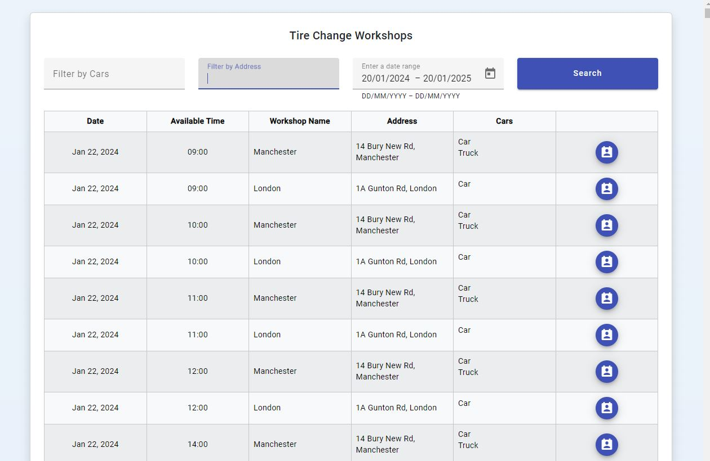
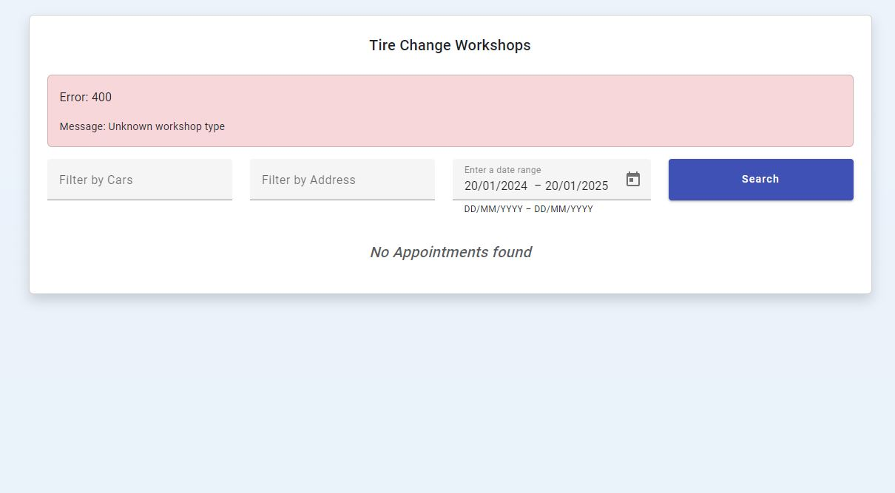
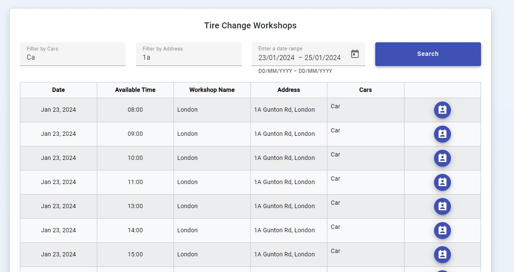
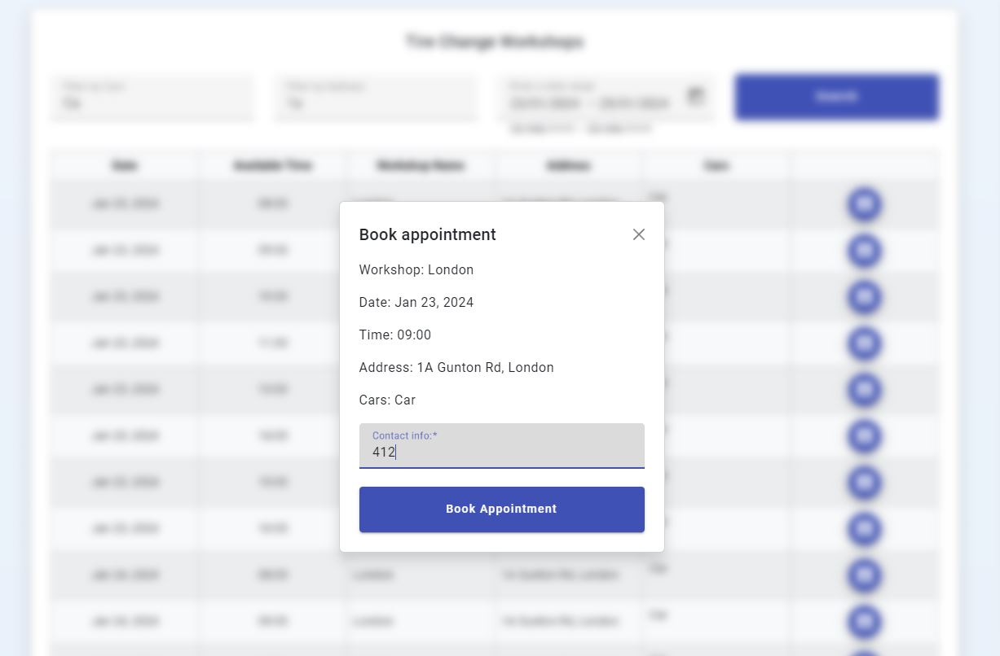
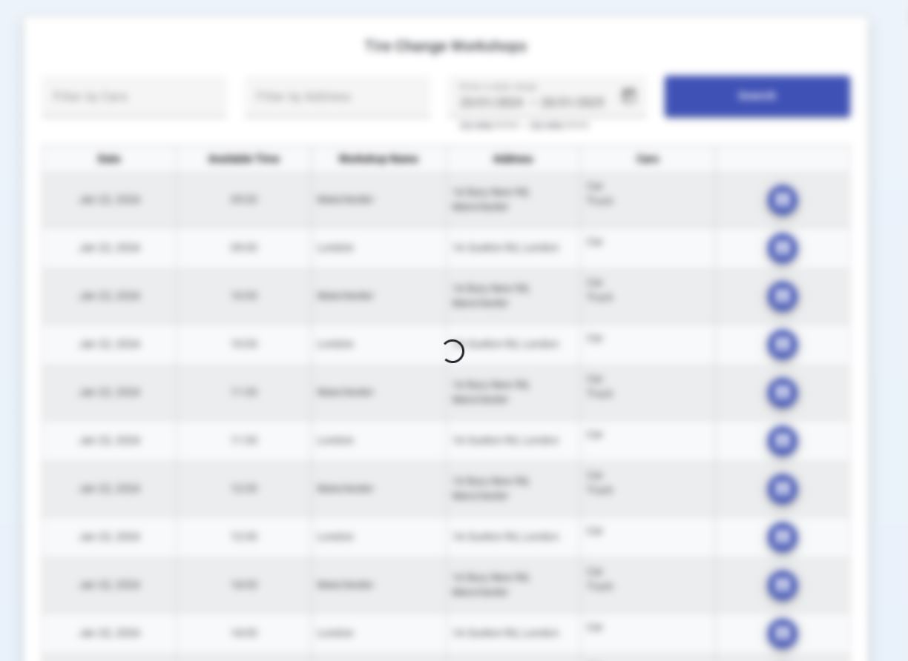

# Backend
Start with command: mvnw clean compile exec:java

Backend uses 2 tire workshop servers: https://github.com/Surmus/tire-change-workshop.

Clients are defined in application.yml

``` yml
clients:
    workshops:
        - url: 'http://localhost:9004/api/v2/'
          address: '14 Bury New Rd, Manchester'
          cars:
              - 'Car'
              - 'Truck'
          name: 'manchester'
          type: 'json'
        - url: 'http://localhost:9003/api/v1/'
          address: '1A Gunton Rd, London'
          cars: 'Car'
          name: 'london'
          type: 'xml'
```

# Frontend

Start with command: npm start (http://localhost:4200/)

## General UI example




## Error handling example



## Filtering example



## Confimation modal example



## Loading example

